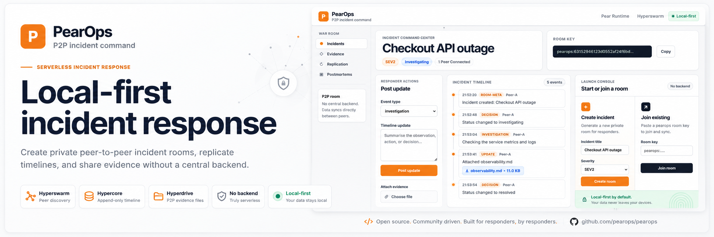

# PearOps



**PearOps is a serverless incident war room for engineering teams.** When production is down, coordination should not depend on another centralized SaaS. PearOps lets responders create a private peer-to-peer room, share timeline updates and evidence files, and let late joiners catch up through replicated local-first data.

This is a hackathon MVP built with Pear/Holepunch building blocks:

- **Hyperswarm** for peer discovery and encrypted peer connections.
- **Corestore + Hypercore** for append-only replicated incident timelines.
- **Hyperdrive** for peer-to-peer evidence files and runbooks.
- **Local web UI** per peer; there is no shared HTTP backend or database server.
- **Pear-friendly terminal app shape**: the P2P core is isolated in `src/peer.js` and uses `Pear.config.storage` automatically when launched inside Pear Runtime, otherwise it uses local `.pearops/*` storage for demos.

## Quick start

```bash
cd ~/dev/pearops
npm install
npm run smoke
```

Expected smoke output:

```json
{
  "ok": true,
  "roomKey": "pearops:...",
  "aEvents": 4,
  "bEvents": 4,
  "attachment": "evidence.txt"
}
```

## Run two local peers

Terminal A:

```bash
npm run peer:a -- --open
```

Terminal B:

```bash
npm run peer:b -- --open
```

If `--open` is not used, open the URLs manually:

- Peer A: <http://localhost:3911>
- Peer B: <http://localhost:3912>

## Demo flow

1. In Peer A, create an incident:
   - Title: `Checkout API outage`
   - Severity: `SEV2`
2. Copy the displayed `pearops:<topic>` room key.
3. In Peer B, paste the room key and join.
4. Wait for the peer badge to show a connection.
5. Post an investigation update from Peer A.
6. Post a mitigation/decision update from Peer B.
7. Attach a text file, screenshot, JSON dump, or runbook from either peer.
8. On the other peer, open/download the attachment from the timeline.
9. Stop one peer, restart it with the same script, rejoin the same room key, and watch it catch up from replicated Hypercores.
10. Click **Export Markdown report** for a postmortem-ready timeline.

## CLI helpers

Create a room and print the room key:

```bash
node src/server.js --name Peer-A --port 3911 --storage .pearops/peer-a --create --title "Checkout API outage"
```

Join a room at startup:

```bash
node src/server.js --name Peer-B --port 3912 --storage .pearops/peer-b --join pearops:<topic>
```

Watch from a terminal-only peer:

```bash
node src/cli.js watch --name Watcher --storage .pearops/watcher --room pearops:<topic>
```

Post from a terminal-only peer:

```bash
node src/cli.js post --name Responder --storage .pearops/responder --room pearops:<topic> --type investigation --message "Database failover started"
```

Attach from a terminal-only peer:

```bash
node src/cli.js attach --name Responder --storage .pearops/responder --room pearops:<topic> --file ./evidence.json
```

## Architecture

```text
Browser UI <-> local Express server <-> PearOpsPeer
                                      ├─ control Hyperswarm: JSON room/key gossip
                                      └─ replication Hyperswarm: Corestore replication stream
                                             ├─ Hypercore writer per peer: append-only timeline
                                             └─ Hyperdrive per peer: attachment files
```

### Incident rooms

A room key is `pearops:` plus a 32-byte Hyperswarm topic in hex. Peers join the topic in both client and server mode, so every participant can announce and discover others through the DHT.

### Timeline replication

Hypercore is single-writer, so PearOps uses a simple multi-writer pattern for the MVP:

- Every peer owns one writable Hypercore.
- Timeline events are appended only to the local peer's writer core.
- Peers gossip writer public keys over the control swarm.
- Once a writer key is known, Corestore replication pulls that append-only log over the replication swarm.
- The UI merges events by id and sorts by timestamp.

This keeps the model easy to explain and avoids a central sequencer.

### Attachments

Every peer owns one writable Hyperdrive for attachments. When a file is attached:

1. The file is written into the local Hyperdrive under `/attachments/...`.
2. A timeline event is appended with `{ driveKey, path, name, size }`.
3. Other peers load that drive by public key and download the file P2P through Corestore replication.

### Pear Runtime notes

Pear application bundles are Hyperdrives and dependencies are staged from `package.json`. This MVP keeps dependencies discrete and avoids bundling so it can be staged later with Pear tooling. The P2P core uses `global.Pear?.config?.storage` when available, falling back to local storage when run with Node for hackathon demos.

A production Pear desktop version would place `src/peer.js` in a Bare worker and keep the renderer/main process as a thin UI shell, following the official `hello-pear-electron` architecture.

## Project structure

```text
src/peer.js       P2P room, Hypercore timeline, Hyperdrive attachment logic
src/server.js     Local UI/API server per peer
src/cli.js        Terminal-only helper commands
public/           Minimal polished demo UI
test/smoke.js     Two-peer replication + attachment smoke test
```

## Known limitations

- Room membership is key-based only; there is no access-control layer beyond possession of the room topic.
- Events are not identity-signed yet.
- Metadata updates are represented as timeline events; there is no CRDT status object.
- A peer must be online to seed its own writer core and Hyperdrive unless a blind peer/always-on seeder is added.
- Search is not implemented; export-to-Markdown is included as the first postmortem helper.

## Next steps

- Add identity-signed timeline events.
- Add blind-peer registration so encrypted incident data remains available when creators go offline.
- Add Hyperbee index for event type/status/search.
- Add QR code in the browser UI for room joins.
- Package as an Electron/Pear Runtime desktop app using a Bare worker for the P2P core.
